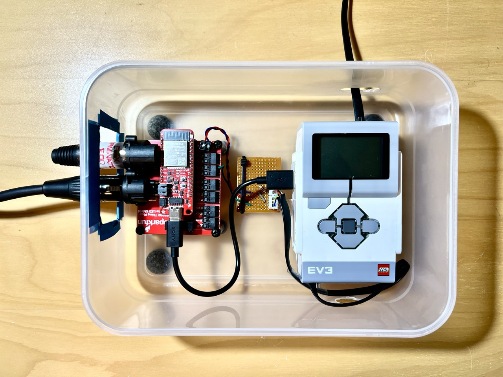

EV3-ClockController
===

This code runs on a LEGO EV3 Brick connected to a servo motor that advances a clock to certain times. It's used on a theater play by Jon Fosse entitled "The Night Signs its Songs".

Here's an image of the project:

This code is used in conjunction with a [EV3 to ESP32/DMX bridge](https://github.com/pjpmarques/DMX512-EV3-Bridge) that I've also developed.

You can see it in action here:

https://github.com/pjpmarques/EV3-ClockController/assets/782106/95eae904-61f0-49eb-8bf5-6afc3f65ed86

License
===
[Apache 2.0](LICENSE.txt)
